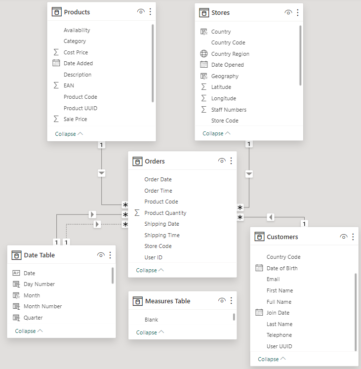
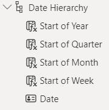
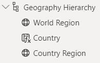
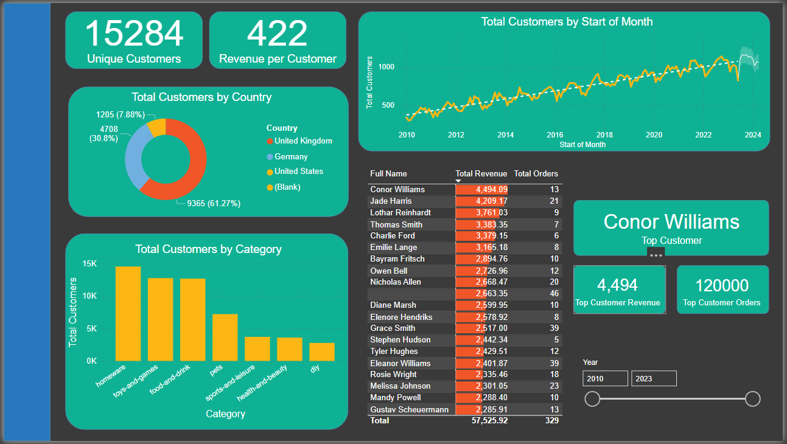

# Data Analysis Power BI Report 501

## Introduction

This is a practice project to test, show and improve my Power BI knowledge. This project is to satisfy the below brief:

"_You have recently been approached by a medium-sized international retailer who is keen on elevating their business intelligence practices. With operations spanning across different regions, they've accumulated large amounts of sales from disparate sources over the years._

_Recognizing the value of this data, they aim to transform it into actionable insights for better decision-making. Your goal is to use Microsoft Power BI to design a comprehensive Quarterly report. This will involve extracting and transforming data from various origins, designing a robust data model rooted in a star-based schema, and then constructing a multi-page report._

_The report will present a high-level business summary tailored for C-suite executives, and also give insights into their highest value customers segmented by sales region, provide a detailed analysis of top-performing products categorised by type against their sales targets, and a visually appealing map visual that spotlights the performance metrics of their retail outlets across different territories._"

## Process

### Import Data to Power BI

The first step is to focus on data loading and preparation. Importing and cleansing the data. The dataset is made up of 4 tables each imported from a different source, via Azure SQL Database, Azure Blob Storage, .csv and folder. Another step within this is to rename columns to fit standard, and provide readability for the report

#### Orders Table

The Orders table is the main fact table, containing information about each order including, order and shipping date, the customer, store and product IDs for associating with the dimension tables. This was imported via Azure SQL Database which meant connecting to the Database and importing the table via the import option on Power BI. The card details are removed to ensure data privacy. For the Order Date and Shipping Date, these were split into 2 columns, for date and time. Any rows that had a missing value for Order Date are removed.

#### Products Table

The products table is a dimension table containing information about each product, product code, name, category, cost price, sale price and weight. This was imported simply as a .csv file. Duplicates were removed so product codes were unique. The weight column was split into 2 new columns, one containing the value and the other the unit. The value can then be converted into decimal format ready for calculation. A new column was also created that converted all columns into kg for easy comparison.

#### Stores Table

The stores table is a dimension table containing information about each store, including store code, store type, country, region and address. This was imported via Azure Blob Storage, accessing a file within storage. The only cleansing was to remove a column that had the same value for all indicating what it's source was.

#### Customers Table

The customers table is a dimension table containing information about each customer, including name, address, email, phone number and date of birth. This was imported via a folder which involved combining 3 tables into one. An extra column was created to combine First and Last Name into a Full Name. The source column was removed as this was redundant.

### Create the Data Model

The next step is to construct the data model for the project. This is creating a Date Table, a star based schema, using measures to incorporate important metrics and establishing date and geographic hierarchies.

#### Creating a Date Table

Using the Calendar function a new table was created with a continuous list of dates from the earliest order date to the latest shipping date. This Date table was filled out with new columns of the following

- Day Number
- Day Name
- Month Number (i.e. Jan = 1, Dec = 12 etc.)
- Month Name
- Quarter
- Year
- Start of Year
- Start of Quarter
- Start of Month
- Start of Week

#### Building the Star Schema Data Model

THe Schema was created to connect each data table with their unique keys. Product Codes, Store Codes, User IDs, Order Date/Shipping Dates

Within this step another table was added to contain all measures that will be created in the following step.

#### Creating Key Measures

A few key measures, that will come in use for the report. The below Key Measures have been added

Total Orders

    Total Orders = COUNT(Orders[Order Date])

Total Revenue

    Total Revenue = SUMX(Orders, Orders[Product Quantity] * RELATED(Products[Sale Price]))

Total Profit

    Total Profit = SUMX(Orders, Orders[Product Quantity] * (RELATED(Products[Sale Price]) - RELATED(Products[Cost Price])))

Total Customers

    Total Customers = COUNTROWS(DISTINCT(Orders[User ID]))

Total Quantity

    Total Quantity = SUM(Orders[Product Quantity])

Profit YTD

    Profit YTD = TOTALYTD([Total Profit], 'Date Table'[Start of Year])

Revenue YTD

    Revenue YTD = TOTALYTD([Total Revenue], 'Date Table'[Start of Year])
    
#### Creating Date and Geography Hierarchies

Creating Hieratchies will allow us to drill down on our report and perform greater analysis. Below show the 2 hierarchies created

### Build Customer Detail Page

The next step is to begin the reports, the first report we will do is a page focusing on customer-level analysis

#### Headline Card Visuals

The two rectangles are the headlines, which show how many customers and the revenue per customer.

Unique customers uses the measure Total Customers, whereas the Revenue per customer is a new measure of

        Revenue per Customer = [Total Revenue] / [Total Customers]

#### Summary Charts

The Donut chart is created by filtering the Customer Country column against the total customers column

The column chart is created by filtering the Product Category column against the total customers column

Clicking any seciton within this chart will cross filter across the rest of the report

#### Line Chart

The line chart is created with the total customers on the y axis and the date heirarchy on the x axis.

This chart can be drilled up and down from year, quarter and month to show different trends. It will also predict the 10 periods.

#### Top 20 Customer Table

The table shows the top 20 customers with their total revenue and orders placed, which can be filtered over country, category and time period

#### Top Customer Cards

The cards in the bottom right show details on the top customer over the filtered time period, using 3 new measures

Top Customer

        Top Customer = MAXX(TOPN(1, Customers, [Total Revenue], DESC), Customers[Full Name])

Revenue 

        Top Customer Revenue = MAXX(Customers, [Total Revenue])

Orders

WIP

#### Date Slicer

The line in the bottom right allows the user to filter between years

