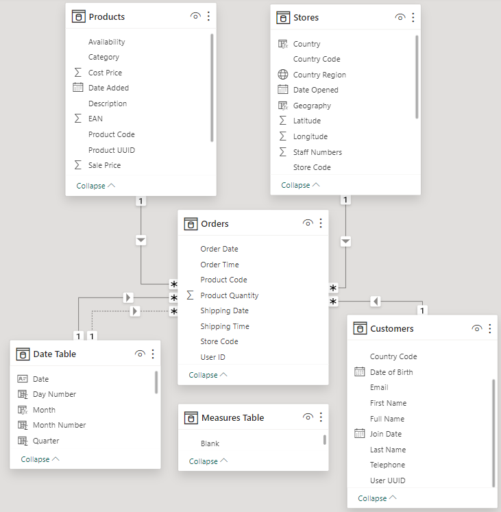
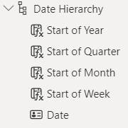
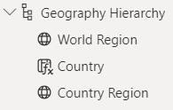
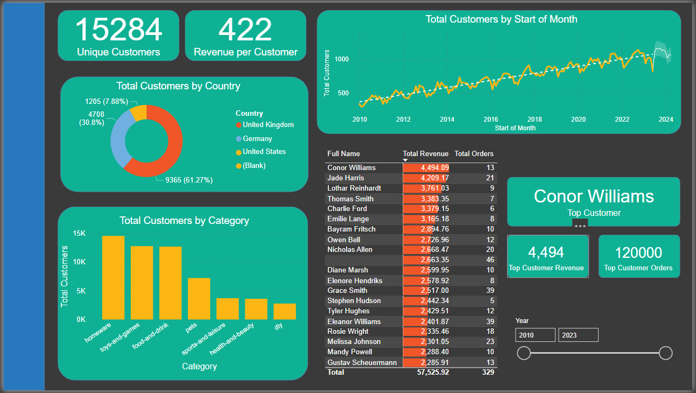
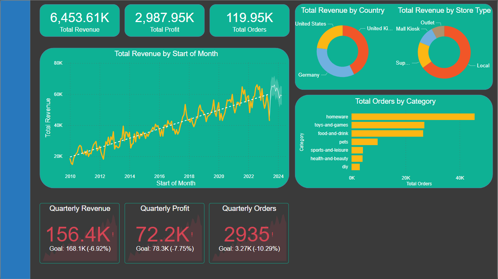

# Data Analysis Power BI Report 501

## Table of Contents
- Introduction
- What I've Learnt
- Process
    - Import Data to Power BI
    - Create Data Model
    - Build Customer Detail Page
    - Create Executive Summary Page
    - Create Product Detail Page
    - Create Stores Map Page
    - Cross-Filtering and Navigation
- SQL Queries

## Introduction

This is a practice project to test, show and improve my Power BI knowledge. This project is to satisfy the below brief:

"_You have recently been approached by a medium-sized international retailer who is keen on elevating their business intelligence practices. With operations spanning across different regions, they've accumulated large amounts of sales from disparate sources over the years._

_Recognizing the value of this data, they aim to transform it into actionable insights for better decision-making. Your goal is to use Microsoft Power BI to design a comprehensive Quarterly report. This will involve extracting and transforming data from various origins, designing a robust data model rooted in a star-based schema, and then constructing a multi-page report._

_The report will present a high-level business summary tailored for C-suite executives, and also give insights into their highest value customers segmented by sales region, provide a detailed analysis of top-performing products categorised by type against their sales targets, and a visually appealing map visual that spotlights the performance metrics of their retail outlets across different territories._"

## What I've Learnt

Within this project I have learned how to utilise a wide variety of different data visuals that each can be used to analyse complex data into a user friendly format. These visuals all have different uses where best to use. I have also learnt about the importance of cross-filtering and how several different data visuals can be combined to create even more powerful summaries of data. Along with this I have expanded my working knowledge of Power BI to create complex note books which can be interacted with, drilling through data, use of bookmarks and page for navigation.

I've also reinforced my learning of SQL and how the use of both methods can be incredibly pwoer tools for data analysis.

## Process

### Import Data to Power BI

The first step is to focus on data loading and preparation. Importing and cleansing the data. The dataset is made up of 4 tables each imported from a different source, via Azure SQL Database, Azure Blob Storage, .csv and folder. Another step within this is to rename columns to fit standard, and provide readability for the report

#### Orders Table

The Orders table is the main fact table, containing information about each order including, order and shipping date, the customer, store and product IDs for associating with the dimension tables. This was imported via Azure SQL Database which meant connecting to the Database and importing the table via the import option on Power BI. The card details are removed to ensure data privacy. For the Order Date and Shipping Date, these were split into 2 columns, for date and time. Any rows that had a missing value for Order Date are removed.

#### Products Table

The products table is a dimension table containing information about each product, product code, name, category, cost price, sale price and weight. This was imported simply as a .csv file. Duplicates were removed so product codes were unique. The weight column was split into 2 new columns, one containing the value and the other the unit. The value can then be converted into decimal format ready for calculation. A new column was also created that converted all columns into kg for easy comparison.

#### Stores Table

The stores table is a dimension table containing information about each store, including store code, store type, country, region and address. This was imported via Azure Blob Storage, accessing a file within storage. The only cleansing was to remove a column that had the same value for all indicating what it's source was.

#### Customers Table

The customers table is a dimension table containing information about each customer, including name, address, email, phone number and date of birth. This was imported via a folder which involved combining 3 tables into one. An extra column was created to combine First and Last Name into a Full Name. The source column was removed as this was redundant.

### Create the Data Model

The next step is to construct the data model for the project. This is creating a Date Table, a star based schema, using measures to incorporate important metrics and establishing date and geographic hierarchies.

#### Creating a Date Table

Using the Calendar function a new table was created with a continuous list of dates from the earliest order date to the latest shipping date. This Date table was filled out with new columns of the following

- Day Number
- Day Name
- Month Number (i.e. Jan = 1, Dec = 12 etc.)
- Month Name
- Quarter
- Year
- Start of Year
- Start of Quarter
- Start of Month
- Start of Week

#### Building the Star Schema Data Model

THe Schema was created to connect each data table with their unique keys. Product Codes, Store Codes, User IDs, Order Date/Shipping Dates

Within this step another table was added to contain all measures that will be created in the following step.

#### Creating Key Measures

A few key measures, that will come in use for the report. The below Key Measures have been added

Total Orders

    Total Orders = COUNT(Orders[Order Date])

Total Revenue

    Total Revenue = SUMX(Orders, Orders[Product Quantity] * RELATED(Products[Sale Price]))

Total Profit

    Total Profit = SUMX(Orders, Orders[Product Quantity] * (RELATED(Products[Sale Price]) - RELATED(Products[Cost Price])))

Total Customers

    Total Customers = COUNTROWS(DISTINCT(Orders[User ID]))

Total Quantity

    Total Quantity = SUM(Orders[Product Quantity])

Profit YTD

    Profit YTD = TOTALYTD([Total Profit], 'Date Table'[Start of Year])

Revenue YTD

    Revenue YTD = TOTALYTD([Total Revenue], 'Date Table'[Start of Year])
    
#### Creating Date and Geography Hierarchies

Creating Hieratchies will allow us to drill down on our report and perform greater analysis. Below show the 2 hierarchies created

### Build Customer Detail Page

The next step is to begin the reports, the first report we will do is a page focusing on customer-level analysis

#### Headline Card Visuals

The two rectangles are the headlines, which show how many customers and the revenue per customer.

Unique customers use the measure Total Customers, whereas the Revenue per customer is a new measure of

        Revenue per Customer = [Total Revenue] / [Total Customers]

#### Summary Charts

The Donut chart is created by filtering the Customer Country column against the total customers column

The column chart is created by filtering the Product Category column against the total customers column

Clicking any section within this chart will cross filter across the rest of the report

#### Line Chart

The line chart is created with the total customers on the y axis and the date heirarchy on the x axis.

This chart can be drilled up and down from year, quarter and month to show different trends. It will also predict the 10 periods.

#### Top 20 Customer Table

The table shows the top 20 customers with their total revenue and orders placed, which can be filtered over country, category and time period

#### Top Customer Cards

The cards in the bottom right show details on the top customer over the filtered time period, using 3 new measures

Top Customer

        Top Customer = MAXX(TOPN(1, Customers, [Total Revenue], DESC), Customers[Full Name])

Revenue 

        Top Customer Revenue = MAXX(Customers, [Total Revenue])

Orders

        Top Customer Orders = MAXX(TOPN(1, Customers, [Total Revenue], DESC), 'Measures Table'[Total Orders])

#### Date Slicer

The line in the bottom right allows the user to filter between years

### Create Executive Summary Page

This page is a report for the high level executive summary, its purpose is to give an overview of the company's performance as a whole and to quickly give insights and check outcomes against key targets.

#### Card Visuals

Firstly is to create some card visuals, these are all from previously created measures of Total Revenue, Total Profit and Total Orders.

#### Revenue Trending Line Chart

Below the cards is a line chart plotting revenue against time, this chart can be drilled down and also provides a future prediction

#### Donut Charts for Revenue by Country and Store Type

To the right of the card visuals are 2 donut charts that break down revenue against country and store type, these can be cross filtered, updated the page for each type

#### Bar Chart of Orders by Product Category

Below the donut charts is a bar chart that shows the total orders against the product category, this also can be cross filtered

#### KPI Visuals

Below the Trending Line Chart shows the KPIs, these allow a quick look at current performance against the target. For this the previous quarter revenue, profit and orders was found with:

        Previous Quarter Profit = CALCULATE(
        'Measures Table'[Total Profit],
        PREVIOUSQUARTER('Date Table'[Date]))

A target value for the current quarter is 5% growth, the output values will show red if below and green if above

#### Top Products Table

The final part is the top products table which will be looked at later, however it is useful on this page when cross filters are applied

### Create Product Detail Page

This page provides a detailed look at which products are performing well with filtering across product and region

# INSERT PRODUCT PAGE IMAGE

#### Gauge Visuals

These gauges show the current quarter value for revenue, profit and orders against the target quarter value for revenue, profit and orders, which is a 10% increase

Current Quarter Value was determined by

        Current Quarter Revenue = TOTALQTD('Measures Table'[Total Revenue], Orders[Order Date]) 

Previous Quarter Value was determined by

        Previous Quarter Revenue Prod = CALCULATE(
        TOTALQTD('Measures Table'[Total Revenue], Orders[Order Date]),
        DATEADD(Orders[Order Date], -1, Quarter))

Target Quarter Value simply by multiplying the previous quarter by 1.1

The Value will show red if below target and white if above target

#### Area Chart of Revenue by Product Category

The area chart shows the total revenue for each product category against time. This chart can be used to cross filter the other elements on the page

#### Top Products Table

Below the area chart is the top 10 products for total revenue, which also shows the total customers, total orders and profit per customer, all these are taken from previous measures. This is useful when cross filtering to see top products for each category

#### Scatter Graph

The scatter graph shows quantity sold against profit per item, highlighted by category. This is a very useful graph to quickly identify the top performing products, which could be further marketed as well as the best performing categories.

Hovering over a dot brings up information and quickly identifies the exact product.

Profit per Item was calculated via

        Profit per Item = Products[Sale Price] - Products[Cost Price]

#### Slicer Toolbar

On this page, it is useful to provide a slicer toolbar for clarity and not cluttering the page.

# INSERT SLICER TOOLBAR

Using a button that links to a bookmark, a menu is opened that allows slicing on the page for product category and country, this menu can be closed again with the back button linking to a bookmark of the original page, whilst also keeping the changes of data.

### Create Stores Map Page

This page provides a map of all stores whilst providing a quick performance insight for each store, and how they are performing against target.

# INSERT MAP PAGE

#### Map Visual

The main part of this page is the store map which shows the store location, where the geography hierarchy is linked to location and Profit YTD is linked to the bubble size.

#### Country Slicer

Above the map is a slicer which allows the map to be filtered by country

#### Stores Drillthrough Page

# INSERT DRILLTHROUGH PAGE

This drillthrough page allows a summary for an individual store.

It contains:
- A Top 5 products, showing Profit YTD, Total Orders, Total Revenue
- A Column chart showing total orders by products
- Gauge for Profit YTD and Revenue YTD against target
- Card Visual for current store

The Gauge visual compares against the current YTD against the previous YTD at the point in the year where the target is a 20% increase.

The Previous YTD is calculated with 

        Profit Goal = CALCULATE(
        TOTALYTD([Total Profit], 'Date Table'[Start of Year]),
        DATEADD('Date Table'[Date], -1, YEAR))

#### Tooltip Page

# INSERT TOOLTIP PAGE

This page allows a quick look at how each individual store is performing, a new page is created that shows when a store is hovered over on the map. It brings up the profit YTD against target gauge form the previous section

### Cross-Filtering and Navigation

The final step is to polish up the pages and provide some usability. Cross-Filtering is applied by default so it is turned off for some elements where it may lead to confusing conclusions. 

THe Navigation bar is finished which allows the user to navigate through each page

# INSERT NAVIGATION

## SQL QUERIES

It may be the case that the client doesn't have access to a visualisation tool like Power BI, so it is also important to understand how to run databse queries that can be returned in friendly formats, I have completed 5 specialised searches which I have included the SQL query and resulting CSV file that is returned.

### Question 1

How many staff are there in all of the UK stores?

### Question 2

Which month in 2022 has had the highest revenue?

### Question 3

Which German store type had the highest revenue for 2022?

### Question 4

Create a view where the rows are the store types and the columns are the total sales, percentage of total sales and the count of orders

### Question 5

Which product category generated the most profit for the "Wiltshire, UK" region in 2021?

